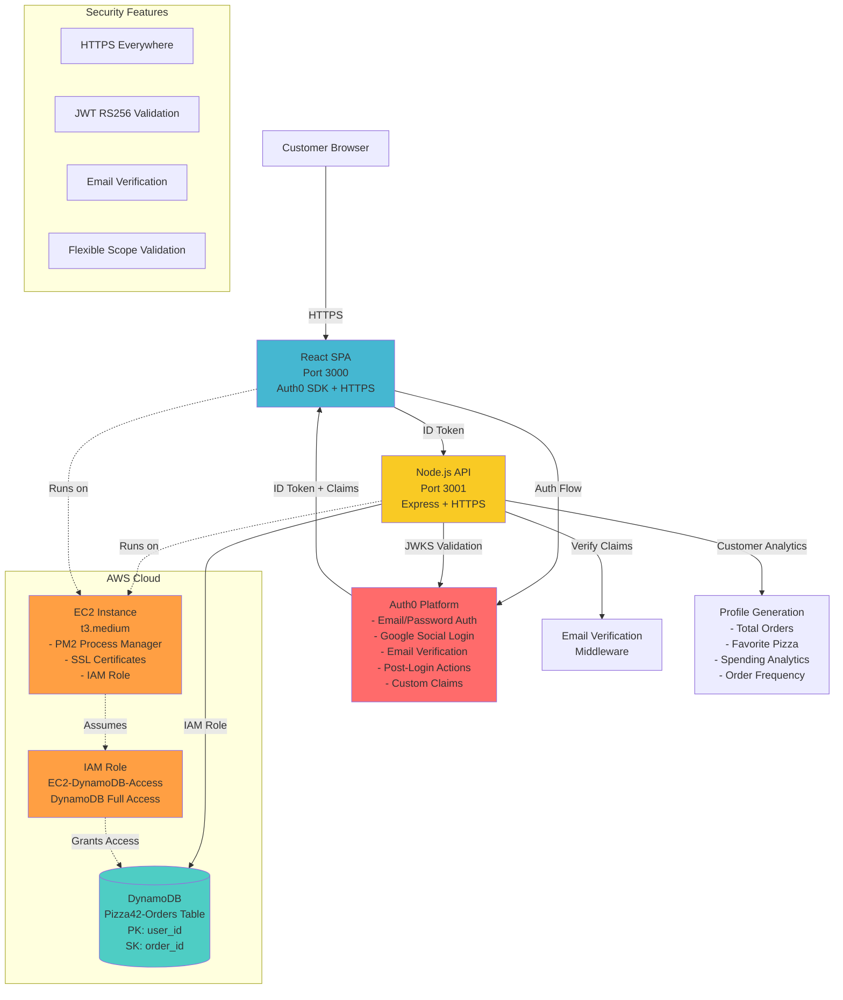

# Pizza 42 - Auth0 CIAM Solution with DynamoDB

A comprehensive proof of concept (PoC) demonstrating how Pizza 42 can leverage Auth0 for customer identity and access management (CIAM) with AWS DynamoDB for scalable order storage.

## Business Use Case

Pizza 42 is modernizing their online ordering system with advanced requirements:
- **Secure Authentication**: Credential management offloaded to Auth0
- **Seamless UX**: Frictionless and customizable login experience with email verification
- **Social Integration**: Social login options and password reset functionality
- **Customer Intelligence**: Enhanced customer profiling and order analytics
- **Scalable Storage**: Enterprise-grade order storage with AWS DynamoDB
- **Production Security**: HTTPS-enforced deployment with comprehensive token validation

## Solution Architecture

This production-ready solution consists of:
- **Frontend**: React SPA with Auth0 SDK and HTTPS enforcement
- **Backend**: Node.js/Express API with comprehensive Auth0 integration
- **Database**: AWS DynamoDB for high-performance order storage and retrieval
- **Infrastructure**: AWS EC2 deployment with IAM roles and SSL certificates
- **Security**: Multi-layer authentication with email verification and ID token validation

## Features Implemented

### **Advanced Authentication & Authorization**
- **Email/Password Authentication**: Auth0 Database connection with secure credential storage
- **Google Social Login**: Seamless OAuth integration for enhanced UX
- **Email Verification Enforcement**: Mandatory email verification before order placement
- **Multi-Token Strategy**: 
  - ID tokens with custom claims for user identity and verification status
  - Access tokens for API authorization with proper scopes
- **Post-Login Actions**: Custom Auth0 actions that add email verification and customer profile claims to tokens

### **Enterprise Order Management**
- **Scalable Order Storage**: AWS DynamoDB with partition key (user_id) and sort key (order_id)
- **Real-time Order Processing**: Instant order placement with DynamoDB PutCommand
- **Customer Analytics**: Dynamic customer profile generation with order statistics:
  - Total orders and lifetime spending
  - Favorite pizza types and sizes
  - Order frequency analysis
  - Customer tenure tracking
- **Order History**: Fast retrieval with DynamoDB Query operations

### **Production-Grade Security**
- **HTTPS Everywhere**: SSL/TLS encryption for all communications
- **JWT Token Validation**: RS256 signature verification with JWKS
- **Dual Token Architecture**: 
  - ID tokens for identity verification and custom claims
  - Flexible scope validation (bypassed for ID tokens, enforced for access tokens)
- **IAM Integration**: AWS EC2 instance roles for secure DynamoDB access
- **Email Verification Middleware**: Multi-layer verification with fallback mechanisms

### **Cloud-Native Infrastructure**
- **AWS EC2 Deployment**: Production-ready t3.medium instance
- **DynamoDB Integration**: NoSQL database with IAM role-based authentication
- **SSL Certificates**: Self-signed certificates for HTTPS in development/demo
- **Process Management**: PM2 for robust application lifecycle management
- **Environment Management**: Separate development and production configurations

## Project Structure

```
pizza42-auth0-challenge/
├── frontend/          # React SPA with Auth0 integration
├── backend/           # Node.js API for order management
│   ├── server-https-debug.js  # HTTPS production server
│   └── server-simple.js       # Local development server
└── docs/              # Documentation and Auth0 configuration
```

## Tech Stack

### **Frontend**
- **React 18**: Modern SPA with hooks and functional components
- **Auth0 React SDK**: Official SDK with PKCE flow support
- **TypeScript**: Type-safe development with enhanced IDE support
- **HTTPS Development Server**: SSL-enabled React dev server

### **Backend** 
- **Node.js 18**: LTS runtime with ES6+ features
- **Express.js**: RESTful API framework with middleware support
- **Auth0 SDKs**: Management API client and JWKS validation
- **AWS SDK v3**: Modern DynamoDB client with IAM role integration
- **PM2**: Production process manager with auto-restart

### **Database & Storage**
- **AWS DynamoDB**: NoSQL database with automatic scaling
- **Table Schema**: Composite primary key (user_id, order_id)
- **Auth0 User Profiles**: Enhanced user metadata and custom claims

### **Infrastructure & Security**
- **AWS EC2**: t3.medium instance (2 vCPU, 4GB RAM)
- **AWS IAM**: Role-based access control for DynamoDB
- **SSL/TLS**: Self-signed certificates for development/demo
- **JWT Security**: RS256 signature validation with JWKS endpoint

## Getting Started

### Local Development
1. Clone the repository
2. Configure Auth0 applications (SPA + API + M2M)
3. Install dependencies: `npm install` in both frontend/ and backend/
4. Set up environment variables (.env files provided)
5. Run backend: `npm start` in backend/
6. Run frontend: `npm start` in frontend/
7. Access at http://localhost:3000

### Production Deployment (AWS EC2)
✅ **Currently deployed and working at: https://52.90.154.69:3000**
- Backend API: https://52.90.154.69:3001
- HTTPS enabled with SSL certificates
- PM2 process management for both frontend and backend
- AWS IAM role integration for DynamoDB access
- Environment-specific configuration files

## Auth0 Configuration

### Applications
- **SPA Application**: `9wcggjvPlN5kfGfqgYG5ksqKmGlbE43e` - React frontend with PKCE flow
- **API**: `https://pizza42-api` - Backend API with RS256 JWT validation and `place:orders` scope
- **M2M Application**: Management API access for user metadata operations

### Connections  
- **Database**: Username-Password-Authentication for email/password login
- **Social**: Google OAuth integration (optional)

### User Management
- Order storage in Auth0 user_metadata
- Auth0 Management API for CRUD operations
- Email verification enforcement

## Architecture Diagram



## Deployment Status

### **LIVE DEPLOYMENT** on AWS EC2

| Component | URL | Status | Details |
|-----------|-----|--------|----------|
| **Frontend** | `https://52.90.154.69:3000` | ✅ Online | React SPA with HTTPS |
| **Backend API** | `https://52.90.154.69:3001` | ✅ Online | Node.js + Express + HTTPS |
| **Database** | `Pizza42-Orders` (DynamoDB) | ✅ Active | NoSQL with IAM integration |
| **Process Manager** | PM2 | ✅ Running | Auto-restart + logging |
| **SSL/TLS** | Self-signed certificates | ✅ Enabled | Development/demo ready |

### **Infrastructure Details**
- **Instance Type**: AWS EC2 t3.medium (2 vCPU, 4GB RAM)
- **Storage**: 20GB EBS GP2
- **IAM Role**: `EC2-DynamoDB-Access-Role` with DynamoDB Full Access
- **Region**: us-east-1 (N. Virginia)

## Security Implementation

### **Multi-Layer Security Architecture**
- **Transport Security**: HTTPS/TLS 1.2+ for all communications
- **Authentication**: Auth0 with PKCE flow and social login options
- **Authorization**: JWT RS256 token validation with JWKS endpoint
- **Email Verification**: Mandatory verification before order placement
- **Token Strategy**: 
  - ID tokens for user identity and verification status
  - Flexible scope validation (bypassed for ID tokens)
- **Infrastructure Security**: AWS IAM roles (no hardcoded credentials)

## Demo Flow - Live Application

### **Experience the Full Pipeline**: https://52.90.154.69:3000

1. **Authentication**
   - Visit the live application
   - Sign up with email/password or use Google login
   - **Email Verification Required**: Check your email and verify
   
2. **Order Placement**
   - Browse pizza menu (Margherita, Pepperoni, Supreme, Hawaiian)
   - Select size (Small, Medium, Large) with dynamic pricing
   - Submit order with ID token authentication
   
3. **Customer Analytics**
   - View your **Profile** section for comprehensive analytics:
     - Total orders and lifetime spending
     - Favorite pizza type and size
     - Order frequency analysis
     - Customer tenure tracking
   
4. **Persistent Storage**
   - Orders stored in **DynamoDB** with real-time access
   - Customer profiles generated dynamically from order data
   - Fast retrieval using DynamoDB Query operations

### **Testing Scenarios**

**New User Flow**:
- Create account → Email verification → Place first order → View analytics

**Returning User Flow**:
- Login → View order history → Place new order → Updated analytics

**Security Testing**:
- Try placing order without email verification (blocked)
- Inspect JWT tokens in browser dev tools
- Test API endpoints directly (proper authentication required)

### **Production Features Verified**
- **Auth0 Integration**: Email/password + Google social login
- **Email Verification**: Enforced before order placement
- **JWT Security**: RS256 signature validation with proper audience
- **DynamoDB Storage**: Real-time order storage and retrieval
- **Customer Analytics**: Dynamic profile generation with order insights
- **HTTPS Security**: End-to-end TLS encryption
- **High Availability**: PM2 process management with auto-restart

---

*This is a technical challenge solution demonstrating Auth0 CIAM implementation for Pizza 42's modernization initiative.*
