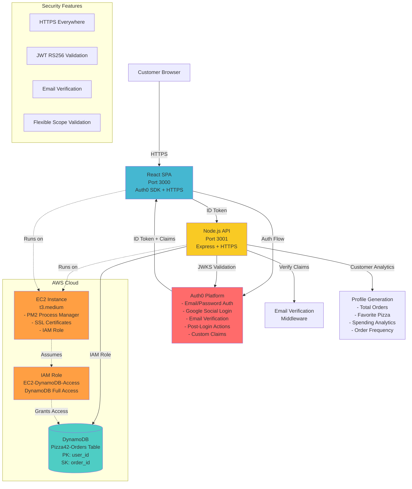
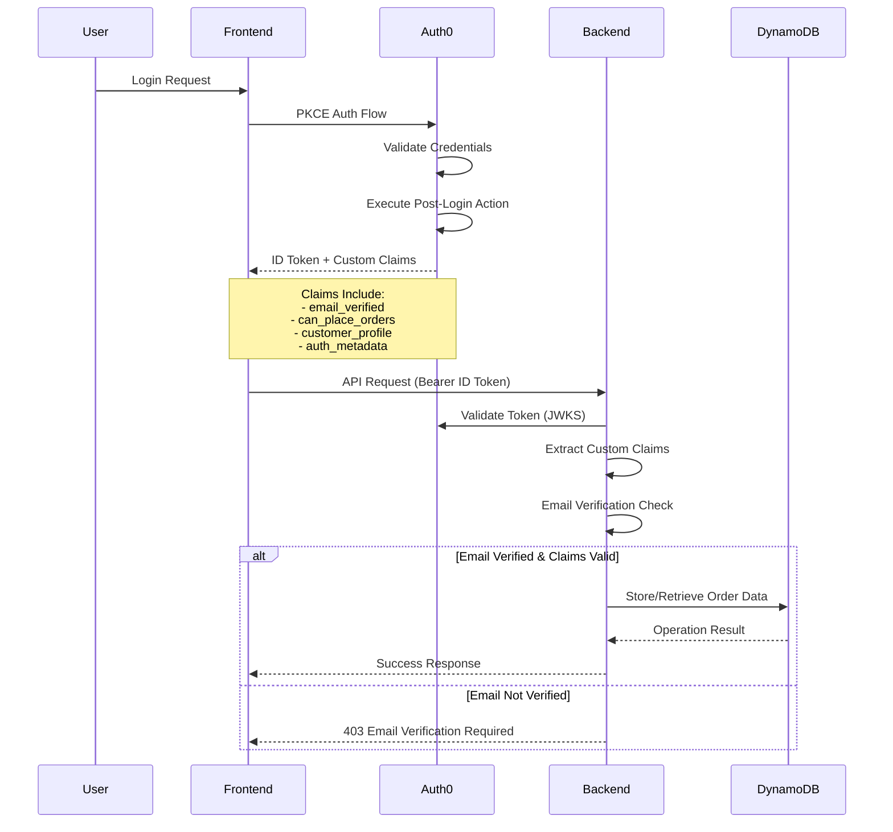
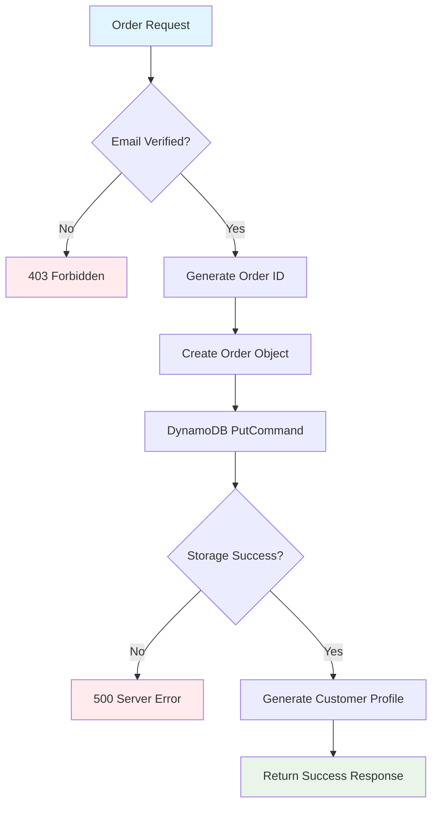
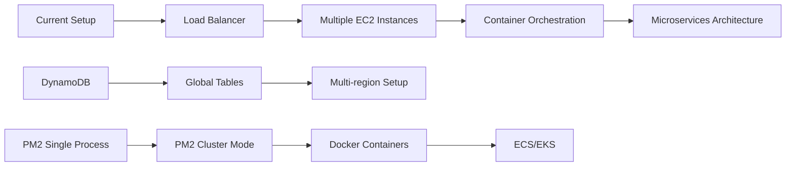
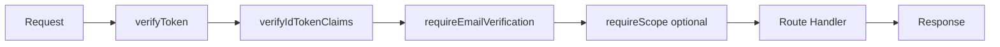

# Pizza42 Architecture Documentation

## Complete System Architecture

The Pizza42 application implements a comprehensive Auth0 CIAM solution with AWS DynamoDB integration, featuring advanced security, customer analytics, and scalable infrastructure.

## Architecture Diagram



## Component Deep Dive

### Authentication & Authorization Layer

#### Auth0 Platform Configuration
- **Applications**: 
  - SPA Application (9wcggjvPlN5kfGfqgYG5ksqKmGlbE43e)
  - API Identifier (https://pizza42-api)
  - M2M Application for Management API access
- **Connections**: Database (email/password) + Google Social
- **Post-Login Actions**: Custom claims injection for email verification and customer profiling
- **Security**: PKCE flow, RS256 JWT validation, proper audience verification

#### Token Strategy


### Order Management System

#### DynamoDB Schema
```json
{
  "TableName": "Pizza42-Orders",
  "KeySchema": [
    {
      "AttributeName": "user_id",
      "KeyType": "HASH"
    },
    {
      "AttributeName": "order_id", 
      "KeyType": "RANGE"
    }
  ],
  "AttributeDefinitions": [
    {
      "AttributeName": "user_id",
      "AttributeType": "S"
    },
    {
      "AttributeName": "order_id",
      "AttributeType": "S"
    }
  ],
  "BillingMode": "PAY_PER_REQUEST"
}
```

#### Order Processing Flow


### Customer Analytics Engine

#### Real-time Profile Generation
The system dynamically generates customer profiles from order data:

```javascript
// Example Generated Profile
{
  total_orders: 15,
  total_spent: 342.50,
  average_order_value: 22.83,
  favorite_size: "large",
  favorite_pizza: "Supreme",
  customer_since: "2025-08-15T10:30:00Z",
  first_order: "2025-08-15T10:30:00Z",
  last_order: "2025-08-27T22:53:18Z",
  order_frequency_per_day: 1.25,
  profile_generated_at: "2025-08-27T22:53:20Z",
  data_source: "dynamodb"
}
```

### Infrastructure as Code

#### AWS Resources Created
1. **IAM Role**: EC2-DynamoDB-Access-Role
2. **Instance Profile**: EC2-DynamoDB-Instance-Profile  
3. **DynamoDB Table**: Pizza42-Orders
4. **EC2 Instance**: i-0220be9bac6efe146

#### Process Management
- **PM2 Configuration**: Auto-restart, logging, cluster mode ready
- **Environment Management**: Separate dev/prod configurations
- **SSL Implementation**: Self-signed certificates for development/demo

### Security Implementation

#### Multi-layer Security Strategy
1. **Transport Layer**: HTTPS/TLS for all communications
2. **Authentication**: Auth0 with social login and MFA ready
3. **Authorization**: JWT validation with custom claims
4. **Data Protection**: IAM roles, no hardcoded credentials
5. **Email Verification**: Mandatory before sensitive operations
6. **Token Security**: RS256 algorithm, JWKS validation, proper audiences

## Performance & Scalability

### Current Capacity
- **Frontend**: React dev server (easily upgradable to production build)
- **Backend**: Single Node.js process (PM2 cluster mode ready)
- **Database**: DynamoDB pay-per-request (auto-scaling)

### Scalability Enhancements


## API Endpoints

### Authentication Endpoints
- **Health Check**: `GET /api/health`
- **Token Verification**: `GET /api/verify-token`

### Order Management Endpoints  
- **Place Order**: `POST /api/orders`
- **Get Orders**: `GET /api/orders`

### Middleware Pipeline


## Environment Configuration

### Production Environment Variables
```bash
# Auth0 Configuration
AUTH0_DOMAIN=dev-if2hx088kpqzkcd7.us.auth0.com
AUTH0_AUDIENCE=https://pizza42-api
AUTH0_CLIENT_ID=9wcggjvPlN5kfGfqgYG5ksqKmGlbE43e

# Auth0 Management API
AUTH0_M2M_CLIENT_ID=gOKXTR5jOkh01QXzFpBxmMqyExycMdVW
AUTH0_M2M_CLIENT_SECRET=***

# AWS DynamoDB Configuration
AWS_REGION=us-east-1
DYNAMODB_TABLE_NAME=Pizza42-Orders

# Server Configuration
PORT=3001
```

## Future Enhancements

### Recommended Next Steps
1. **Production Build**: Replace dev servers with production builds
2. **Load Balancer**: Add ALB/CloudFront for high availability
3. **Monitoring**: CloudWatch dashboards and alerts
4. **CI/CD Pipeline**: Automated deployment pipeline
5. **Security**: WAF, VPC, KMS encryption
6. **Performance**: CloudFront CDN, API caching
7. **Microservices**: Split into order service, user service, analytics service

---

*This architecture demonstrates enterprise-grade Auth0 CIAM integration with modern AWS services, designed for scalability and security.*
